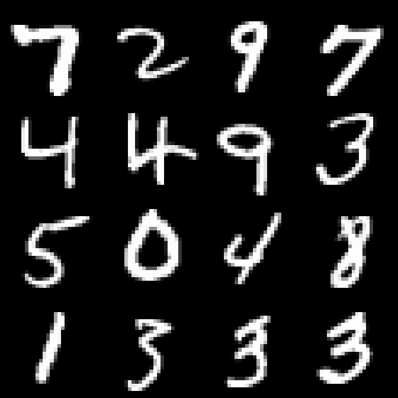
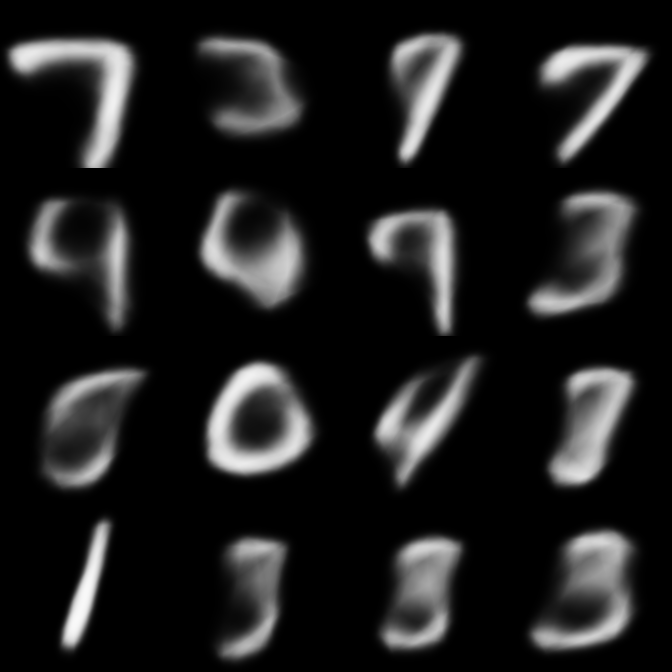
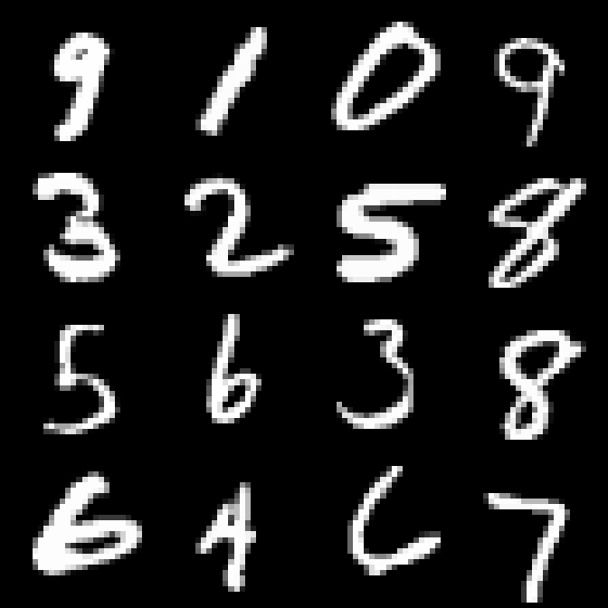
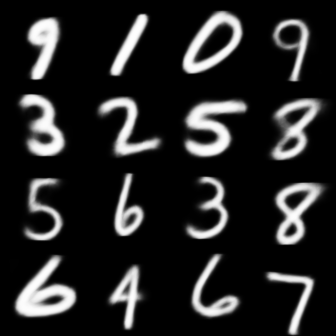

# Sampling Autoencoder
Resolution independent image representation on neural network.

This implementation is based on VAE.
The decoder model represents a function f(u, v, z_1, ..., z_n) which outputs the value at point (u, v) on the image.

## Run
Tested on Python 3.6.3 + Chainer 3.4.0.
You may need CUDA GPU.
```
python3 train.py --gpu 0
```

## Output
### 1st epoch

Original image.


Reconstructed image rendered as 168x168.

### 50th epoch

Original image.


Reconstructed image rendered as 168x168 on 50th epoch.

